# YANA Phase 2 統合仕様書 v1.1

**作成日**: 2025年12月29日  
**プロジェクト**: YANA (Your Autonomous Navigation Assistant)  
**目的**: JetRacer強化計画の次段階への移行

---

## 1. エグゼクティブサマリー

### 1.1 現在の状態

| 項目 | 状態 |
|------|------|
| ハードウェア | ✅ マイク・IMU・LiDAR固定完了 |
| 音声取得 | ✅ 実験成功、取得可能を確認 |
| リポジトリ | ✅ yana-brain, jetracer-agent 存在 |
| 要素技術調査 | ✅ NanoSAM, DA3, FunctionGemma 調査完了 |

### 1.2 目指すゴール

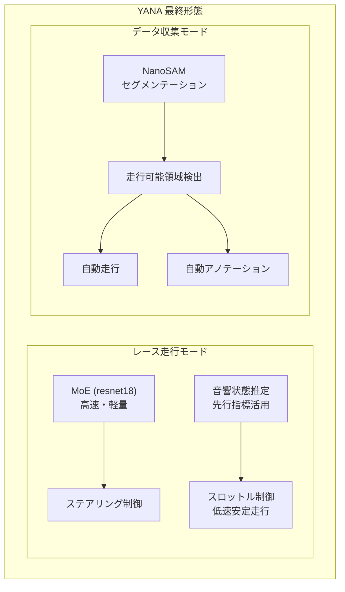

### 1.3 開発パイプライン全体像

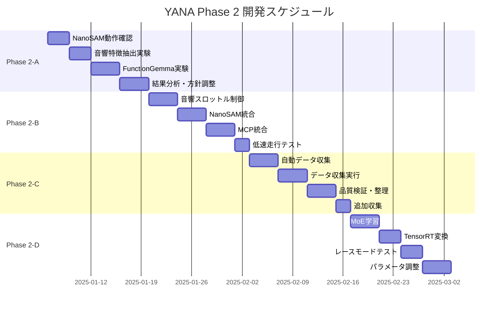

---

## 2. システムアーキテクチャ

### 2.1 リポジトリ構成

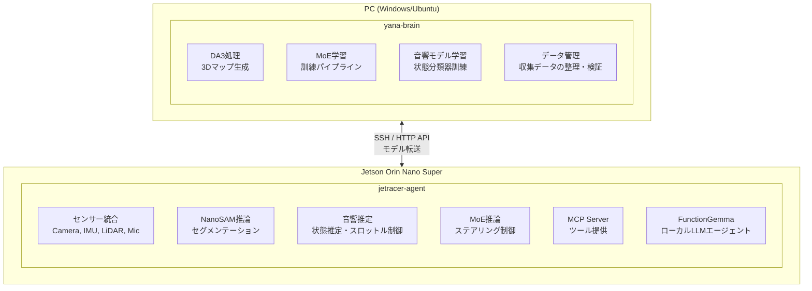

### 2.2 jetracer-agent 構成（計画）

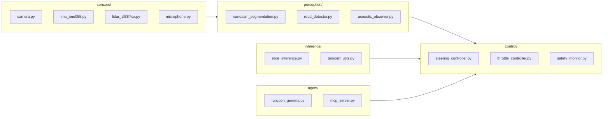

### 2.3 yana-brain 構成（計画）

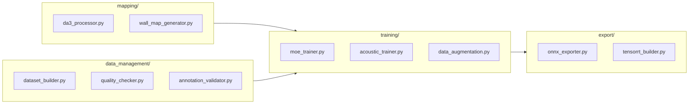

---

## 3. Phase 2-A: 要素実験（2週間）

### 3.1 実験1: NanoSAM動作確認

**目的**: Jetson上でNanoSAMが実用的な速度で動作することを確認

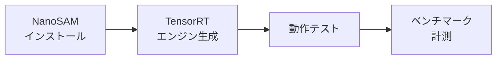

**手順**:
```bash
# 1. NanoSAMインストール
cd ~/jetracer-agent
git clone https://github.com/NVIDIA-AI-IOT/nanosam
cd nanosam
pip install -e . --break-system-packages

# 2. TensorRTエンジン生成
python scripts/export_sam_encoder.py
python scripts/export_sam_decoder.py

# 3. 動作テスト
python scripts/demo.py --image test.jpg
```

**検証項目**:
| 項目 | 目標値 | 測定方法 |
|------|--------|---------|
| 推論時間 | < 50ms | time.perf_counter() |
| メモリ使用量 | < 1GB | tegrastats |
| セグメンテーション品質 | 目視確認 | 走行可能領域の検出精度 |

**成果物**:
- `perception/nanosam_segmentation.py`
- ベンチマーク結果レポート

### 3.2 実験2: 音響特徴抽出

**目的**: モーター・サーボ音からMFCC特徴量を抽出し、状態との相関を確認

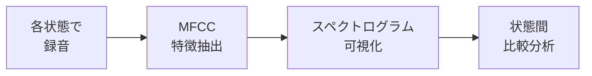

**収集する状態**:
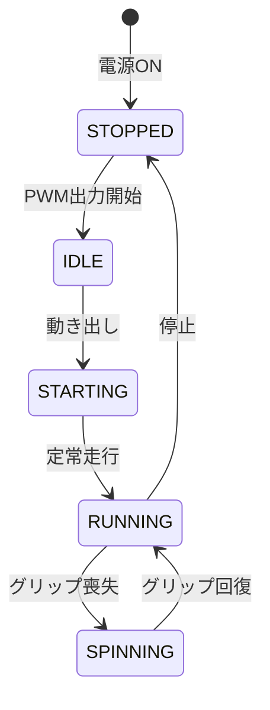

**検証項目**:
| 状態 | 確認ポイント |
|------|-------------|
| 停止 vs 動作 | エネルギーレベルの差 |
| 低速 vs 高速 | 基本周波数の違い |
| 空転 vs 接地 | スペクトル形状の差 |
| 動き出し前兆 | 時系列変化パターン |

**成果物**:
- 各状態のMFCC可視化
- `sensors/microphone.py`
- `perception/acoustic_observer.py` (基礎版)

### 3.3 実験3: FunctionGemma適用

**目的**: FunctionGemmaがJetson上でMCPツール選択を実行できることを確認

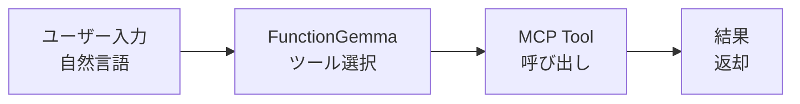

**テストケース**:
| 入力 | 期待されるツール |
|------|----------------|
| 「前に進んで」 | set_throttle |
| 「カメラの画像を見せて」 | get_camera_frame |
| 「データ収集を始めて」 | start_recording |
| 「今の姿勢を教えて」 | get_imu_data |

**検証項目**:
| 項目 | 目標値 |
|------|--------|
| ツール選択正確度 | > 80% |
| 応答時間 | < 1秒 |
| メモリ使用量 | < 2GB |

**成果物**:
- `agent/function_gemma.py`
- ツール選択精度レポート

---

## 4. Phase 2-B: 基盤構築（2週間）

### 4.1 音響ベース低速走行システム

**目標**: 音響フィードバックで安定した低速走行を実現

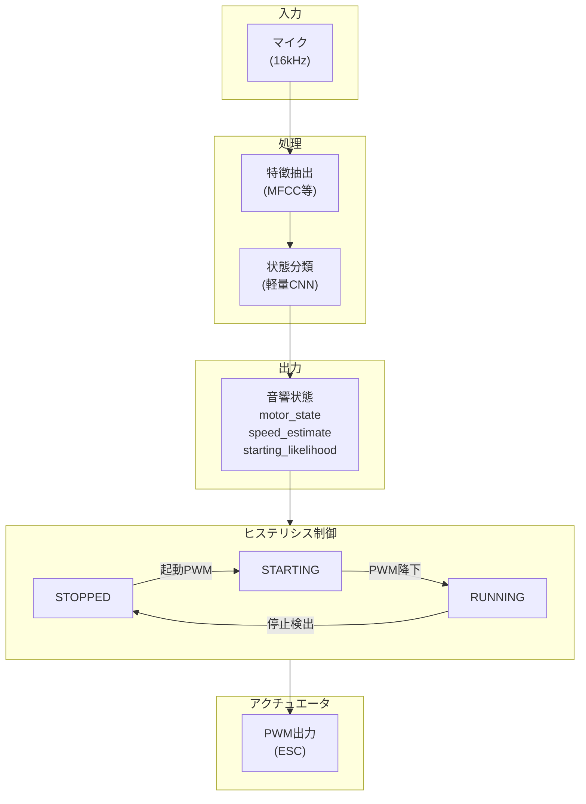

**状態遷移詳細**:

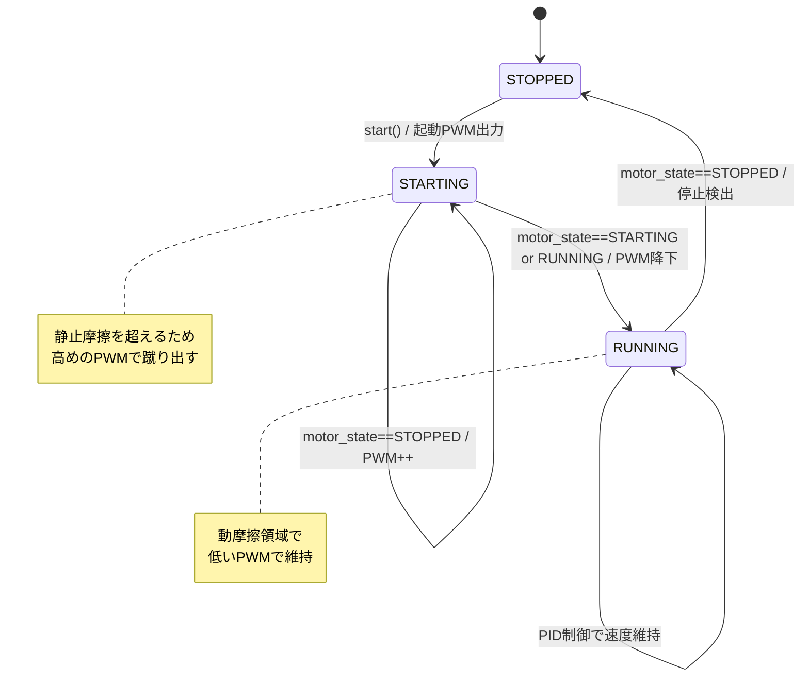

**実装タスク**:
| タスク | ファイル | 優先度 |
|--------|---------|--------|
| マイク入力モジュール | `sensors/microphone.py` | 高 |
| MFCC特徴抽出 | `perception/acoustic_observer.py` | 高 |
| 状態分類器（ルールベース初版） | `perception/acoustic_observer.py` | 高 |
| ヒステリシス制御 | `control/throttle_controller.py` | 高 |
| 学習データ収集ツール | `data_collection/acoustic_recorder.py` | 中 |

### 4.2 NanoSAMセグメンテーション統合

**目標**: リアルタイムで走行可能領域を検出

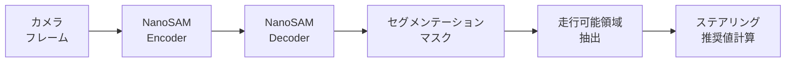

**ステアリング計算ロジック**:

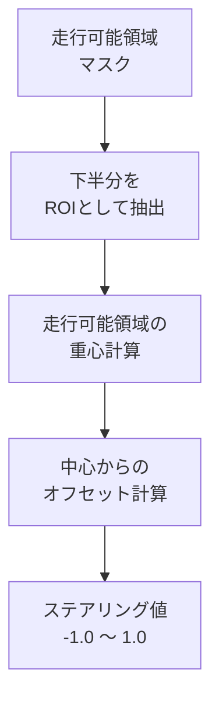

### 4.3 MCP統合

**目標**: FunctionGemmaがMCPツールを呼び出せるようにする

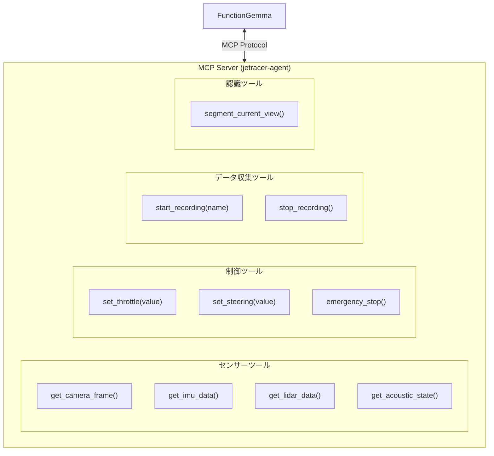

---

## 5. Phase 2-C: 統合開発（2週間）

### 5.1 自動データ収集システム

**目標**: NanoSAM + 音響制御で自動的に走行し、学習データを収集

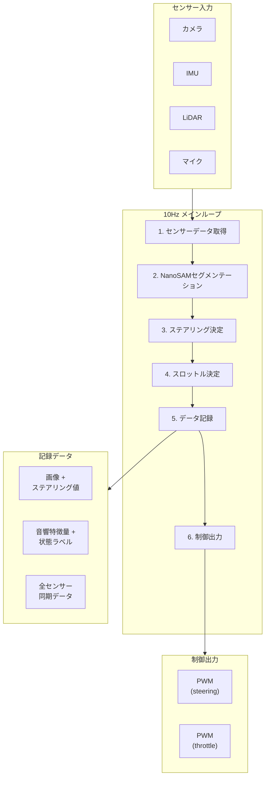

**自動アノテーションフロー**:

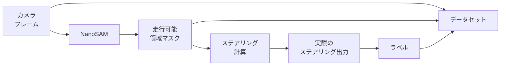

### 5.2 品質検証パイプライン

**yana-brain側での検証フロー**:

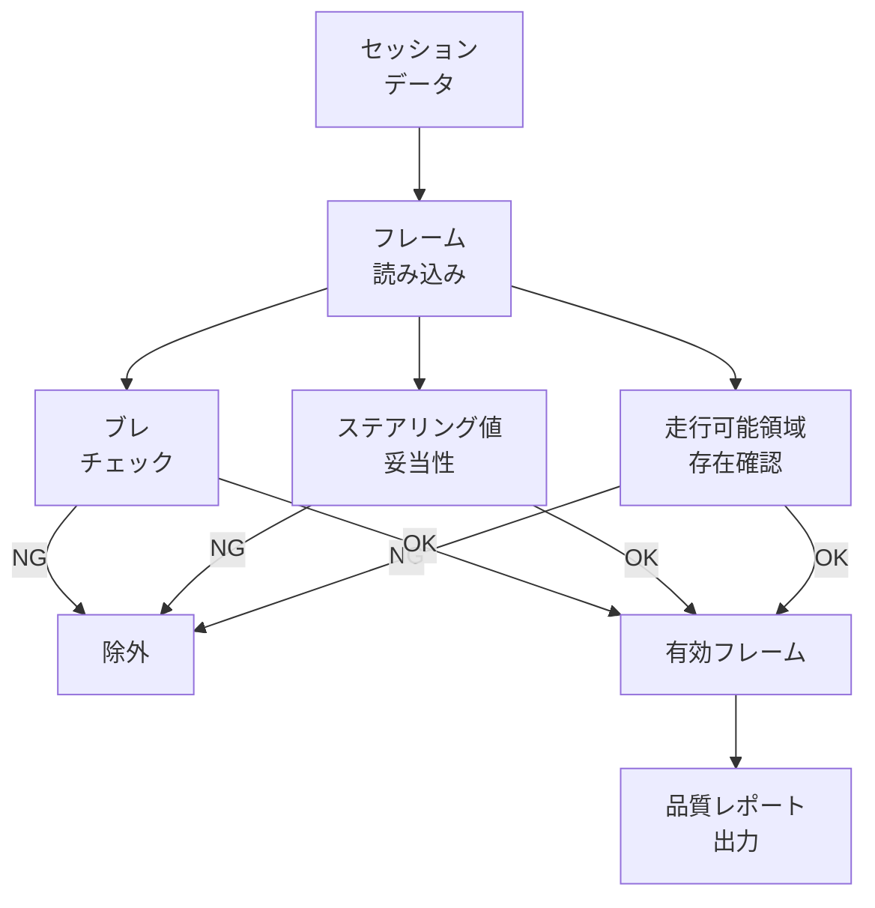

---

## 6. Phase 2-D: レース準備（2週間）

### 6.1 MoE学習

**Mixture of Experts アーキテクチャ**:

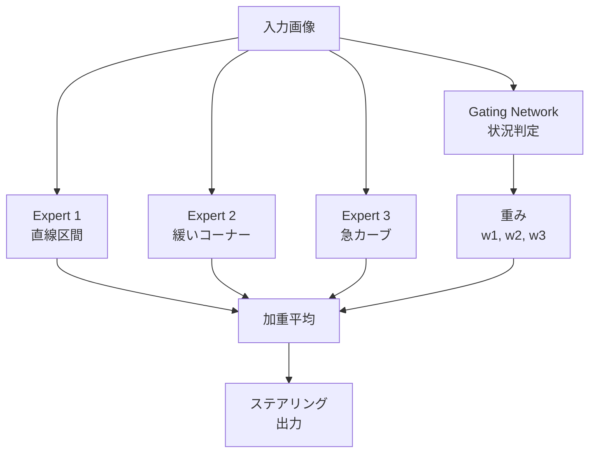

**学習パイプライン**:

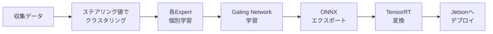

### 6.2 レース走行モード

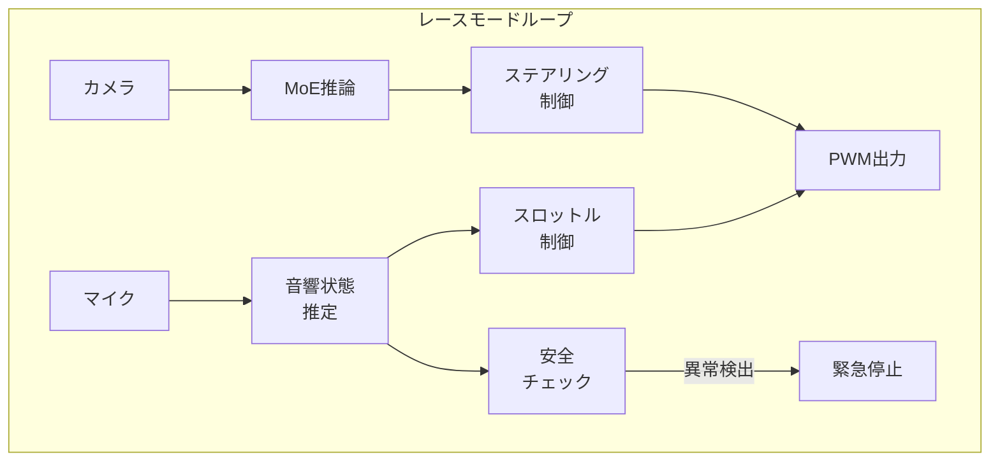

---

## 7. センサー仕様

### 7.1 現在のハードウェア構成

| センサー | 型番 | インターフェース | サンプリング |
|---------|------|-----------------|-------------|
| カメラ | CSI Camera | MIPI CSI | 15 FPS |
| IMU | BNO055 | I2C | 100 Hz |
| LiDAR | VL53L7CX | I2C | 10 Hz |
| マイク | USB Microphone | USB/ALSA | 16 kHz |

### 7.2 センサー配置

```mermaid
flowchart TB
    subgraph JetRacer["JetRacer 構成"]
        subgraph Front["前方"]
            Camera["📷 Camera<br/>前方向き"]
            SteerServo["Steering<br/>Servo"]
        end
        
        subgraph Center["中央 (Jetson上)"]
            IMU["🔲 IMU<br/>BNO055"]
            Mic["🎤 Mic<br/>USB"]
        end
        
        subgraph Rear["後方"]
            Motor["Motor<br/>+ ESC"]
            LiDAR["LiDAR<br/>VL53L7CX<br/>下向き"]
        end
    end
    
    Front --- Center --- Rear
```

---

## 8. パフォーマンス目標

### 8.1 推論速度

| コンポーネント | 目標 | 優先度 |
|---------------|------|--------|
| NanoSAM | < 50ms | 高 |
| 音響特徴抽出 | < 10ms | 高 |
| 音響分類 | < 5ms | 高 |
| MoE (resnet18) | < 30ms | 中 |
| FunctionGemma | < 500ms | 低 |

### 8.2 メモリ配分（8GB）

```mermaid
pie title メモリ配分 (8GB)
    "OS/システム" : 1.5
    "NanoSAM (TensorRT)" : 0.5
    "音響処理 (librosa)" : 0.2
    "MoE (TensorRT)" : 0.3
    "FunctionGemma (Q4)" : 1.5
    "カメラ/バッファ" : 0.5
    "余裕" : 3.5
```

### 8.3 制御ループ

| モード | ループ周波数 | 備考 |
|--------|-------------|------|
| データ収集 | 10 Hz | NanoSAM + 音響制御 |
| レース走行 | 30 Hz | MoE + 音響制御 |

---

## 9. 実装スケジュール

### Week 1-2: Phase 2-A（要素実験）

```mermaid
gantt
    title Phase 2-A 詳細スケジュール
    dateFormat  YYYY-MM-DD
    section NanoSAM
    インストール        :a1, 2025-01-06, 1d
    TensorRT変換       :a2, after a1, 1d
    動作テスト         :a3, after a2, 1d
    section 音響
    録音環境構築       :b1, after a3, 1d
    各状態録音         :b2, after b1, 1d
    MFCC分析          :b3, after b2, 1d
    section FunctionGemma
    モデル導入         :c1, after b3, 2d
    ツール選択テスト   :c2, after c1, 2d
    section まとめ
    結果分析           :d1, after c2, 2d
    方針調整           :d2, after d1, 2d
```

### Week 3-4: Phase 2-B（基盤構築）

| 日程 | タスク | 担当 |
|------|--------|------|
| Day 1-4 | 音響スロットル制御基盤 | jetracer-agent |
| Day 5-8 | NanoSAM統合 | jetracer-agent |
| Day 9-12 | MCP統合 | jetracer-agent |
| Day 13-14 | 低速走行テスト | jetracer-agent |

### Week 5-6: Phase 2-C（統合開発）

| 日程 | タスク | 担当 |
|------|--------|------|
| Day 1-4 | 自動データ収集システム | jetracer-agent |
| Day 5-8 | データ収集実行（5-10周） | jetracer-agent |
| Day 9-12 | 品質検証・データ整理 | yana-brain |
| Day 13-14 | 問題修正・追加収集 | 両方 |

### Week 7-8: Phase 2-D（レース準備）

| 日程 | タスク | 担当 |
|------|--------|------|
| Day 1-4 | MoE学習 | yana-brain |
| Day 5-7 | TensorRT変換・デプロイ | yana-brain → jetracer-agent |
| Day 8-10 | レースモードテスト | jetracer-agent |
| Day 11-14 | パラメータチューニング | 両方 |

---

## 10. リスクと対策

```mermaid
flowchart LR
    subgraph Risks["リスク"]
        R1["NanoSAMが遅い"]
        R2["音響分類精度が低い"]
        R3["FunctionGemmaが不安定"]
        R4["メモリ不足"]
        R5["データ品質が低い"]
    end
    
    subgraph Mitigations["対策"]
        M1["解像度下げる<br/>キャッシュ活用"]
        M2["ルールベース<br/>フォールバック"]
        M3["MCPツール<br/>直接呼び出し"]
        M4["同時ロード<br/>モデル数制限"]
        M5["品質チェック強化<br/>手動フィルタ"]
    end
    
    R1 --> M1
    R2 --> M2
    R3 --> M3
    R4 --> M4
    R5 --> M5
```

---

## 11. 成功基準

### Phase 2-A 完了条件
- [ ] NanoSAMが50ms以下で推論
- [ ] 音響特徴量と状態の相関確認
- [ ] FunctionGemmaがツール選択80%以上

### Phase 2-B 完了条件
- [ ] 音響制御で低速一定走行（5m以上）
- [ ] NanoSAMで走行可能領域を正しく検出
- [ ] MCPツール呼び出しが動作

### Phase 2-C 完了条件
- [ ] 自動走行で1周完走
- [ ] 1000フレーム以上のデータ収集
- [ ] データ品質80%以上

### Phase 2-D 完了条件
- [ ] MoEモデルの学習完了
- [ ] レースモードで3周完走
- [ ] 衝突なしで走行

---

## 12. 改訂履歴

| バージョン | 日付 | 内容 |
|-----------|------|------|
| v1.0 | 2025-12-29 | 初版作成 |
| v1.1 | 2025-12-29 | 図をmermaid形式に変更 |

---

## 付録A: 参考文献・リンク

- [NanoSAM](https://github.com/NVIDIA-AI-IOT/nanosam)
- [DA3](https://github.com/facebookresearch/DA3)
- [FunctionGemma](https://huggingface.co/google/gemma-2-2b-function-calling)
- [MCP Specification](https://spec.modelcontextprotocol.io/)
- [librosa](https://librosa.org/)
